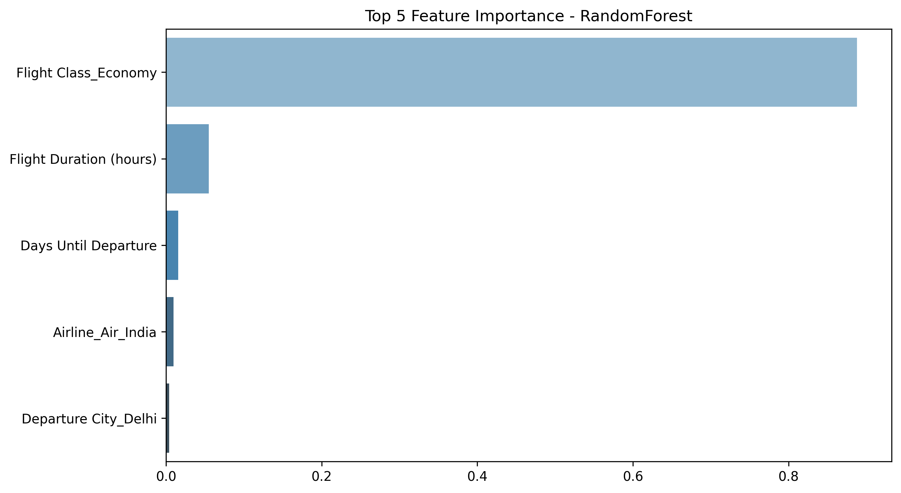

# ✈️ Flight Price Prediction Project

Welcome to the **Flight Price Prediction** project! This initiative aims to predict flight prices using machine learning models, leveraging various flight-related factors to build a robust and accurate model. The project is part of the prestigious **Digital Egyptian Pioneer Initiative (DEPI)** under the **IBM Data Science Track**.

### 🚀 Project Overview
By analyzing flight data and applying machine learning techniques, the project aims to provide insights for both **travelers** and **airlines** to better understand flight pricing. This will be achieved through a full data science pipeline, from **data cleaning** to **model deployment**.

---

## 🗂️ Dataset Description
The dataset provides detailed flight information to fuel the prediction model, including:
- ✈️ **Airline**: Airline operating the flight.
- 🌍 **Source City**: City from which the flight departs.
- 🕓 **Departure Time**: Scheduled departure time (morning, evening, etc.).
- 🛑 **Stops**: Number of stops (non-stop, 1 stop, 2+ stops).
- 🕗 **Arrival Time**: Scheduled arrival time.
- 🌆 **Destination City**: City where the flight lands.
- 💺 **Class**: Travel class (economy, business).
- ⏱️ **Duration**: Flight duration (in hours).
- 📅 **Days Left**: Number of days until departure.
- 💵 **Price**: Price of the flight (in INR).

---

## 🎯 Project Goal
The goal is to build a predictive model that estimates flight prices using the dataset's features, offering valuable insights for both passengers and airlines. The process follows a complete **data science pipeline**, starting from data cleaning and ending with model deployment.

---

## 🛠️ Stage 1: Data Cleaning
The dataset was meticulously cleaned to prepare it for analysis and modeling. Key actions included:
1. 🔄 **Column Renaming**: Renamed columns to be more descriptive (e.g., `source_city` to `Departure City`).
2. 🔢 **Numeric Conversion**: Converted categorical columns like `stops` to numerical values.
3. 💱 **Currency Conversion**: Converted the `price` column from INR to USD using a fixed conversion rate.
4. 🧹 **Dropping Unnecessary Columns**: Removed irrelevant columns like `flight` and `Unnamed: 0`.

🔗 Explore the code and notebook:
- [Data Cleaning Notebook](notebooks/01_data_cleaning.ipynb)
- [Cleaned Dataset](data/processed/flights%20cleaned.csv)
- [Data Cleaning Script](src/cleaning.py)

---

## 📊 Stage 2: Exploratory Data Analysis (EDA)

In this stage, I performed **Exploratory Data Analysis (EDA)** to uncover insights about the dataset and its features. Visualizations helped reveal key relationships:

### Key Insights:
- 📍 **Airline & City Distribution**: Certain airlines dominate, and many flights originate from key cities.
- 💸 **Price & Flight Duration**: A strong correlation between flight duration, number of stops, and price.
- 💼 **Class & Price**: Business class is significantly more expensive than economy.
- 🕒 **Time of Departure**: Departure time influences the price, with some times being costlier than others.

🔗 Explore EDA resources:
- [EDA Notebook](notebooks/02_eda.ipynb)
- [EDA Script](src/eda.py)
- [EDA Visualizations](reports/figures)

---

## 🛠️ Stage 3: Feature Engineering

In this stage, I transformed the raw data to make it suitable for machine learning.

### Key Steps:
- 🔄 **One-Hot Encoding**: Transformed categorical variables like 'Airline', 'City', and 'Flight Class' into numerical features.
- 📏 **Feature Scaling**: Scaled continuous variables such as 'Duration' and 'Days Left' using `StandardScaler`.
- 🔍 **Correlation Analysis**: Generated a correlation matrix to identify the most influential features.
- ✂️ **Train-Test Split**: Split the dataset into training (80%) and testing (20%) sets for evaluation.

🔗 Explore feature engineering resources:
- [Feature Engineering Notebook](notebooks/03_feature_engineering.ipynb)
- [Feature Engineering Script](src/feature_engineering.py)
- [Processed Training Data](data/processed/x_train_processed.csv)
- [Processed Testing Data](data/processed/x_test_processed.csv)

---

## 🛠️ Stage 4: Modeling

In this stage, I built and evaluated multiple machine learning models to predict flight prices based on the engineered features from Stage 3.

### 📊 Models Used:
- **Linear Regression**
- **Random Forest Regressor**
- **K-Neighbors Regressor**
- **Decision Tree Regressor**
- **LightGBM Regressor**

### 🔑 Key Steps:
1. **Model Training**: Trained each model using the processed training data.
2. **Model Evaluation**: Assessed model performance using **R² Score** and **Root Mean Squared Error (RMSE)** to measure how well the models predict flight prices.
3. **Performance Comparison**: Compared the performance metrics of all models to identify the best-performing model.
4. **Visualization**: Created visualizations to compare the R² scores and RMSE values across models for better interpretability.

### 📈 Results:
- The **Random Forest Regressor** achieved the highest R² score and the lowest RMSE, indicating superior performance over the other models.
- The performance metrics for each model are summarized in the figure below.

### 📁 Files and Resources:
- [Modeling Notebook](notebooks/04_modeling.ipynb)
- [Modeling Python Script](src/modeling.py)
- [Model Performance Figure](reports/figures/model_performance.png)

---

## 🔍 Stage 5: Results Analysis and Model Tuning

In this stage, I focused on fine-tuning the models and analyzing the results. I utilized **RandomizedSearchCV** for hyperparameter tuning and performed **cross-validation** to ensure model robustness.

### 🔑 Key Steps:
1. **Hyperparameter Tuning**: Employed RandomizedSearchCV to tune the following models:
   - **RandomForestRegressor**
   - **KNeighborsRegressor**
   - **DecisionTreeRegressor**
   - **LightGBM Regressor**

2. **Evaluation Metrics**: Evaluated the tuned models using:
   - **R² Score**: Indicates the proportion of variance in the dependent variable that is predictable from the independent variables.
   - **RMSE (Root Mean Squared Error)**: Measures how well the predictions match the actual values.

3. **Model Comparison**: Compared models based on R² score and RMSE to identify the best performer.

4. **Cross-Validation**: Conducted 5-fold cross-validation on the best model (**RandomForestRegressor**) to ensure generalizability.

5. **Feature Importance**: Analyzed feature importance for the best-performing model (RandomForestRegressor) to identify the most influential features in predicting flight prices.

### 📈 Results:
- **RandomForestRegressor** performed the best after hyperparameter tuning, achieving:
  - **R² Score**: 0.985
  - **RMSE**: 33.193 (on the test set)

- Cross-validation results for **RandomForestRegressor** produced an average RMSE of **2100.35** across 5 folds.

- **Feature Importance**: The top 5 most important features for flight price prediction were identified and are visualized in the figure below.

### 📁 Files and Resources:
- [Model Tuning and Results Analysis Notebook](notebooks/05_results_analysis.ipynb)
- [Feature Importance Plot](reports/figures/top_5_feature_importance_random_forest.png)
- [Model Tuning Python Script](src/results_analysis.py)

---

## 🔜 Next Steps:
Proceed to **Stage 6: Model Deployment**, where I will deploy the final model and create a user interface for predicting flight prices.

